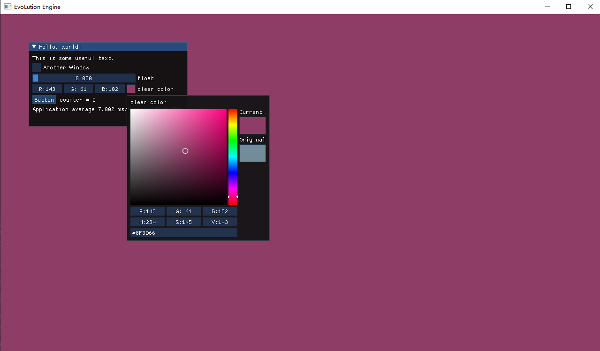

# Path-Tracing-Render-Enegine

## To do

- load model
- ray collison with triange
- brdf
- Path Trace use OpenGl
- creat a Cornell Box scene
- material editor
- TAA Filter
- update to real time rendering
- ...